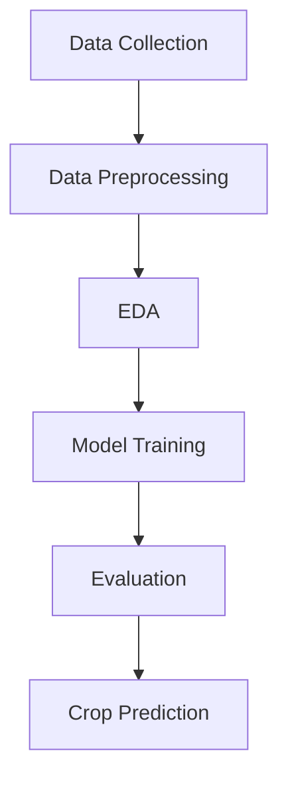

 🌱 Crop Recommendation System

🚀 Machine Learning for Smart Agriculture


 📌 Overview

This project presents an intelligent **Crop Recommendation System** built using Machine Learning.
It helps identify the most suitable crop based on soil nutrients and environmental conditions.

 Developed as part of my **M.Sc. Computer Science research (baseline implementation)**.


## 🎯 Objectives

✔ Analyze soil and environmental parameters
✔ Train and compare multiple ML models
✔ Predict the **best crop among 22 crops**
✔ Provide a data-driven solution for agriculture


## 🌾 Problem Statement

Selecting the right crop is crucial for:

Increasing agricultural productivity
Avoiding soil degradation
Improving farmers’ income

👉 This system replaces traditional decision-making with **AI-based recommendations**.


## 🧠 Models Implemented

| Model                  | Description                     |
| ---------------------- | ------------------------------- |
| Decision Tree       | Fast and interpretable          |
| KNN                 | Distance-based classification   |
| Logistic Regression | Probabilistic model             |
| SVM                 | High-dimensional classification |
| Gradient Boosting   | High accuracy ensemble          |
| QDA                 | Statistical classification      |


## 📊 Dataset

*  Source: Kaggle Crop Recommendation Dataset
*  Features:

  * Nitrogen (N)
  * Phosphorus (P)
  * Potassium (K)
  * Temperature
  * Humidity
  * pH
  * Rainfall

---

## ⚙️ Tech Stack

* 🐍 Python
* 🤖 Scikit-learn
* 📊 Pandas & NumPy
* 📉 Matplotlib / Seaborn
* 📓 Jupyter Notebook

---

## 🔬 Workflow



---

## 📈 Results

* Accurate prediction across **22 crop classes**
* Tree-based models performed best
* Reliable system for decision support in agriculture

---

## 🗂️ Project Structure

```bash
crop_recommendation/
│── README.md
│── crop_recommendation_baseline_DT.ipynb
```

---

## ▶️ Getting Started

### 1️⃣ Clone the repository

```bash
git clone https://github.com/your-username/crop_recommendation.git
```

### 2️⃣ Navigate to the project

```bash
cd crop_recommendation
```

### 3️⃣ Run the notebook

```bash
Google Colab
```


## 💡 Future Improvements

* 🔌 IoT integration (real-time soil data)
* 🌐 Web application deployment
* ⚡ Real-time API
* 🧠 Deep Learning models

---

## 🌍 Real-World Impact

This project contributes to:

* Smart Farming 🌱
* Precision Agriculture
* Sustainable food production


## 👩‍💻 Author

**GBADABIZO Akouvi Yemima Honorine**
🎓 M.Sc. Software Engineering


##  Support

If you like this project, consider giving it a ⭐ on GitHub!


## 📌 Note

This project serves as a **baseline for further research**, especially toward IoT-based intelligent agriculture systems.
